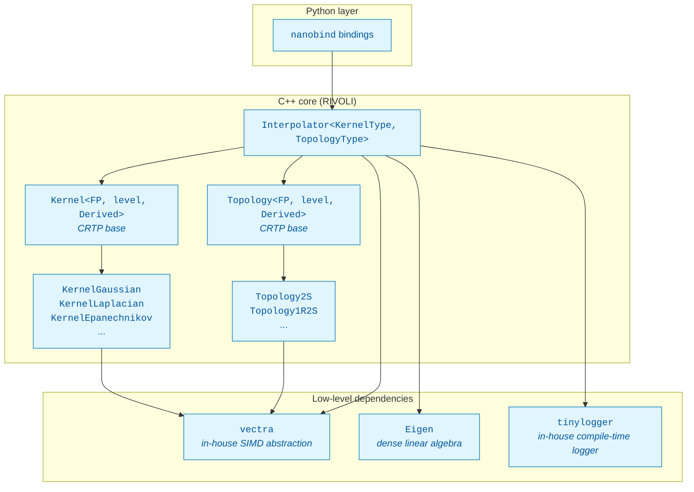
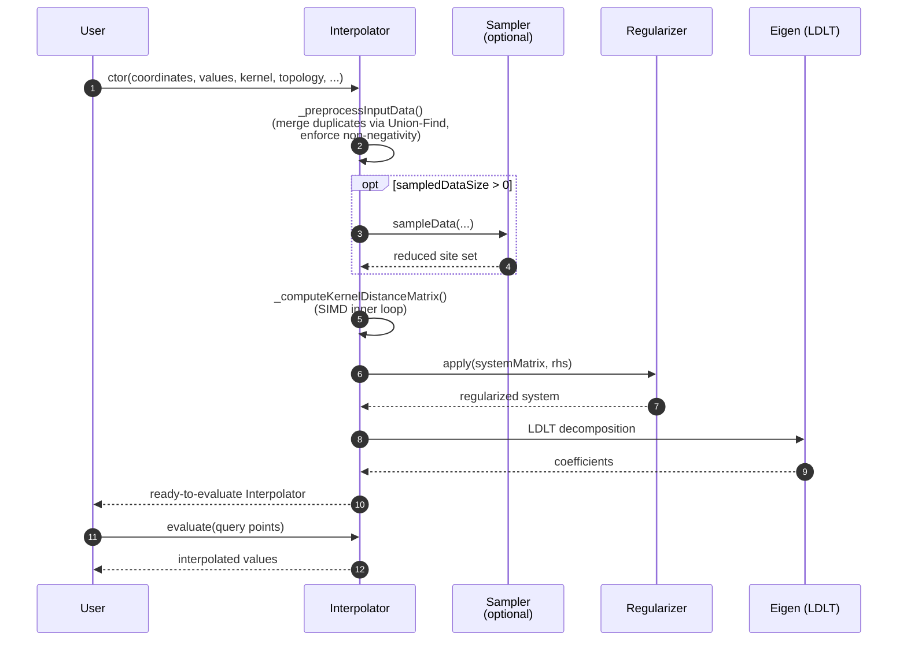

# RIVOLI — Architecture

This document describes how RIVOLI is structured, **why** it is structured this
way (and yes — if you already had a look at some of the headers and are wondering 
why there are so many templates everywhere, jump to [§1.2](#12-heavy-templating-and-crtp). 
There is an explanation, really!), and how the main  components fit together. It 
is intended for developers who want to understand the codebase before reading it,
debugging it, or extending it.

For step-by-step recipes (how to add a new kernel, a new topology, run the
tests, etc.), see [`CONTRIBUTING.md`](./CONTRIBUTING.md).

**Contents**
 
1. [Quick Look](#1-quick-look)
2. [The Interpolation Pipeline](#2-the-interpolation-pipeline)
3. [Component Deep-Dive](#3-component-deep-dive)
4. [Extending the Library — Overview](#4-extending-the-library--overview)
5. [Design Decisions and Trade-offs](#5-design-decisions-and-trade-offs)
6. [Where to go next](#6-where-to-go-next)
---

## 1. Quick Look
 
RIVOLI is a high-performance C++ library for **Radial Basis Function (RBF)
interpolation** on arbitrary topologies. The design revolves around a single
central class — `Interpolator` — that is mainly parameterized by two policy
components: a **Kernel** and a **Topology**.

### 1.1 The big picture



### 1.2 Heavy templating and CRTP

Ok, here we are: yes, it is heavy. Yes, the type
signatures get long. No, it is not the prettiest C++ you will ever read. But
there is a reason for all of it, and once you internalize the pattern the
rest of the code falls into place.
 
The core is **heavily templated**. Every numerical type (`float`, `double`),
every SIMD width (scalar, SSE, AVX2, AVX-512), every kernel, every topology
generates its own concrete type. This is intentional: the goal is **maximum
CPU throughput with zero virtual dispatch**.
 
`Kernel` and `Topology` are both implemented with the **Curiously Recurring
Template Pattern (CRTP)**:

```cpp
template <typename FP, vectra::SIMDLevel level, typename DerivedKernel>
class Kernel {
    vct operator()(const vct& r) const {
        return static_cast<const DerivedKernel*>(this)->_runKernel(r);
    }
};
 
class KernelGaussian : public Kernel<FP, level, KernelGaussian<FP, level>> { ... };
```

The CRTP base provides the **public interface** (`operator()`, scalar
overloads, anisotropic overloads selected via C++20 `requires` clauses). Each
derived class only has to implement its hot inner loop — typically a single
`_runKernel` or `_getDistance` function. The call is fully resolved at compile
time, inlined, and vectorized.
 
The flip side is **compile times and binary size**: instantiating
`Interpolator<KernelGaussian<float, AVX2>, Topology2S<float, AVX2>>` pulls in
a substantial amount of code. This is why the Python layer pre-instantiates a
curated set of combinations rather than exposing the full template space.

### 1.3 Two performance-critical helpers
 
Two macros come up everywhere in the code base and are worth a mention up
front:
 
- **`LOG_TRACE`, `LOG_DEBUG`, `LOG_VERBOSE`, `LOG_INFO`, `LOG_WARNING`, `LOG_ERROR`, `LOG_CRITICAL`.**
  These come from `tinylogger`, a home-made single-header logging library. Each level can
  be compiled out entirely: in release builds, calls below the configured
  threshold leave **no code in the binary**. This means we can keep verbose
  trace points inside hot loops during development without paying for them in
  production.
- **`FORCE_INLINE`.** Provided by `vectra`. It expands to the
  compiler-specific attribute that forces inlining (`__forceinline` on MSVC,
  `__attribute__((always_inline))` on GCC/Clang). It is used on every small
  SIMD-bearing function — kernels, distance functions, topology accessors —
  so that the optimizer can fuse them into the surrounding loops instead of
  emitting a function call per element.

Together these two tools let the source code stay readable and instrumented
while the compiled output stays lean.

---

## 2. The Interpolation Pipeline
 
Building an `Interpolator` and evaluating it goes through several stages.
Knowing the pipeline helps when debugging or profiling.
 

 
The stages, briefly:
 
1. **Preprocessing.** Input coordinates are scanned for near-duplicates (under
   the topology's own distance, not Euclidean) using a Union-Find structure.
   Duplicates are merged by averaging their values. Optional non-negativity
   is enforced by taking the square root of the right-hand side (and squared
   at evaluation).
2. **Sampling (optional).** When the user requests `sampledDataSize > 0`, a
   subset of representative sites is selected. This trades accuracy for
   speed and matrix size — useful for very large datasets.
3. **Kernel-distance matrix.** The dense N×N matrix `K_ij = kernel(d(x_i,
   x_j))` is built. This is the most SIMD-intensive step (even if for now,
   it is always computed in scalar mode. Better performance will come). 
   Anisotropic kernels take a different code path that retains the distance
   components separately (see [§3.2](#32-topologies-and-anisotropy)).
4. **Regularization.** Tikhonov-style regularization is applied to stabilize
   the system before solving.
5. **LDLT solve.** Eigen's `LDLT` factorization gives us the coefficients.
   We chose LDLT over LU for speed; in exchange we trust the regularizer to
   keep the matrix positive-definite enough. The condition number is
   estimated from the LDLT diagonal and a warning is emitted if it is
   suspiciously high.

---

## 5. Design Decisions and Trade-offs
 
A few choices deserve being stated explicitly:
 
- **CRTP over virtual dispatch.** Kernels and topologies are called inside
  the innermost loops of the matrix build and the evaluation. A virtual call
  would defeat inlining and vectorization. CRTP gives us polymorphism for
  free at compile time.
- **LDLT over LU.** Faster, and the regularizer is responsible for keeping
  the system well-behaved. When the matrix turns out to be ill-conditioned,
  we warn rather than silently fall back: this surfaces problems early. Please
  note that this choice is temporary: we are working on a solver's selector that
  will adapt to the problem at hand and choose the best algorithm on the fly.
- **Pre-computed constants in kernels.** `1 / (2σ²)` is stored once at
  construction instead of being recomputed each call. The constructor pays
  the divisions; the hot loop only multiplies.
- **Heavy templating accepted, mitigated by Python.** We do not try to hide
  the template parameters behind type erasure in C++ — that would cost
  performance. We hide them at the Python layer instead, where users who
  want raw speed are not the audience anyway.

---

## 6. Where to go next
 
- **Want to extend the library?** → [`CONTRIBUTING.md`](./CONTRIBUTING.md)
- **Want the public API?** → the Python docs / docstrings will arrive soon!
- **Want the math?** → wait again, and soon you'll see the algorithm references
and mathematical descriptions!
