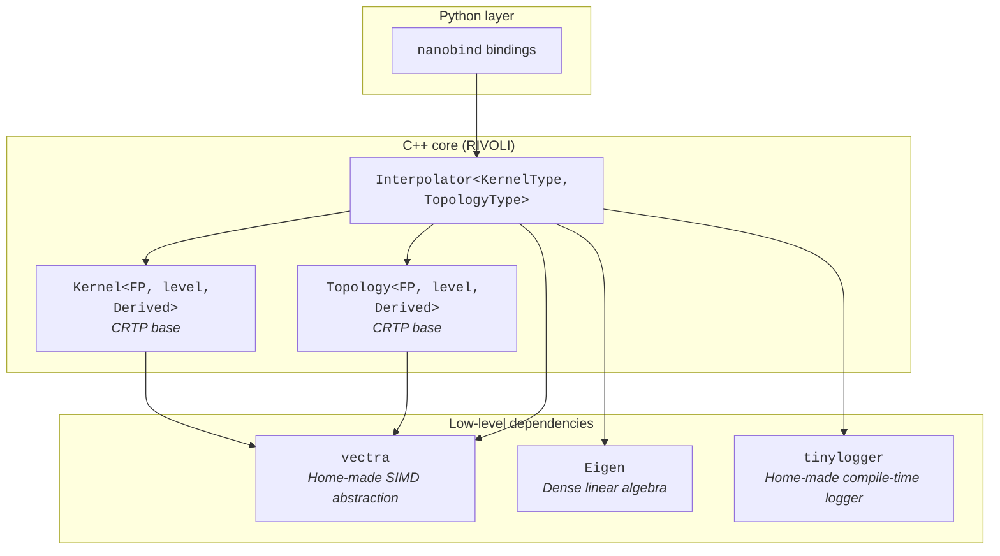
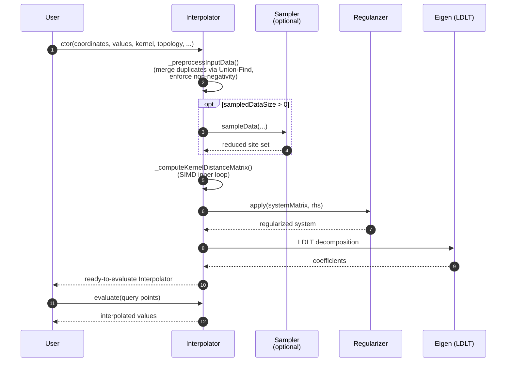

# RIVOLI — Architecture

This document describes how RIVOLI is structured, **why** it is structured this
way (and yes — if you already had a look at some of the headers and are wondering 
why there are so many templates everywhere, jump to [§1.2](#12-heavy-templating-and-crtp). 
There is an explanation, really!), and how the main  components fit together. It 
is intended for developers who want to understand the codebase before reading it,
debugging it, or extending it.

For step-by-step recipes (how to add a new kernel, a new topology, run the
tests, etc.), see [`CONTRIBUTING.md`](./CONTRIBUTING.md).

**Contents**
 
1. [Quick Look](#1-quick-look)
2. [The Interpolation Pipeline](#2-the-interpolation-pipeline)
3. [Component Deep-Dive](#3-component-deep-dive)
4. [Extending the Library — Overview](#4-extending-the-library--overview)
5. [Design Decisions and Trade-offs](#5-design-decisions-and-trade-offs)
6. [Where to go next](#6-where-to-go-next)
---

## 1. Quick Look
 
RIVOLI is a high-performance C++ library for **Radial Basis Function (RBF)
interpolation** on arbitrary topologies. The design revolves around a single
central class — `Interpolator` — that is mainly parameterized by two policy
components: a **Kernel** and a **Topology**.

### 1.1 The big picture



- **Python layer.** A thin [nanobind](https://github.com/wjakob/nanobind)
  binding exposes a small set of pre-instantiated `Interpolator` flavors. End
  users get a friendly, NumPy-compatible API without paying the template
  compilation cost.
- **C++ core.** `Interpolator`, `Kernel`, `Topology` and their derived classes.
  This is where the math lives.
- **Low-level dependencies.** [`vectra`](https://github.com/fmargall/vectra) (a home-made SIMD abstraction
  layer), [Eigen](https://libeigen.gitlab.io/) for the dense linear system
  solve, and [`tinylogger`](https://github.com/fmargall/tinylogger) for diagnostics that vanish in release builds, with a zero cost at runtime.

### 1.2 Heavy templating and CRTP

Ok, here we are: yes, it is heavy. Yes, the type
signatures get long. No, it is not the prettiest C++ you will ever read. But
there is a reason for all of it, and once you internalize the pattern the
rest of the code falls into place.
 
The core is **heavily templated**. Every numerical type (`float`, `double`),
every SIMD width (scalar, SSE, AVX2, AVX-512), every kernel, every topology
generates its own concrete type. This is intentional: the goal is **maximum
CPU throughput with zero virtual dispatch**.
 
`Kernel` and `Topology` are both implemented with the **Curiously Recurring
Template Pattern (CRTP)**:

```cpp
template <typename FP, vectra::SIMDLevel level, typename DerivedKernel>
class Kernel {
    vct operator()(const vct& r) const {
        return static_cast<const DerivedKernel*>(this)->_runKernel(r);
    }
};
 
class KernelGaussian : public Kernel<FP, level, KernelGaussian<FP, level>> { ... };
```

The CRTP base provides the **public interface** (`operator()`, scalar
overloads, anisotropic overloads selected via C++20 `requires` clauses). Each
derived class only has to implement its hot inner loop — typically a single
`_runKernel` or `_getDistance` function. The call is fully resolved at compile
time, inlined, and vectorized.
 
The flip side is **compile times and binary size**: instantiating
`Interpolator<KernelGaussian<float, AVX2>, Topology2S<float, AVX2>>` pulls in
a substantial amount of code. This is why the Python layer pre-instantiates a
curated set of combinations rather than exposing the full template space.

#### An explanation of a little compiler wizardry

A pattern you will see several times inside the `Interpolator` class looks like this:

```cpp
vct distance = [&]<std::size_t... I>(std::index_sequence<I...>) {
    return _topology.getDistance(_coordinates[I][i]..., coordinatesSIMD[I]...);
}(std::make_index_sequence<_dimension>{});
```

It is dense, it has three dots in unusual places, and it does not look like
normal C++ — so it deserves an explanation.
 
**The problem it solves.** Topologies expose `getDistance` as a function
taking `2 × dimension` scalar arguments: in 2D,
`getDistance(x1, y1, x2, y2)`; in 3D, `getDistance(x1, y1, z1, x2, y2, z2)`;
and so on. The number of arguments is therefore not fixed — it depends on
the topology's dimension, which is a **compile-time** constant
(`TopologyType::dimension`). We need a way to call `getDistance` with the
right number of arguments, **generated from a compile-time integer**, without
writing one overload per dimension.
 
**How it works.** The trick is to unpack a sequence of indices using a
generic lambda with an explicit template parameter list (a C++20 feature).
Step by step:
 
1. `std::make_index_sequence<_dimension>{}` builds a compile-time list of
   indices: `<0, 1>` in 2D, `<0, 1, 2>` in 3D, etc.
2. That sequence is passed to a generic lambda whose template parameters
   `<std::size_t... I>` capture it as a **parameter pack**.
3. Inside the lambda, `coordinates[I][i]...` is a **pack expansion**: it
   gets unfolded into `coordinates[0][i], coordinates[1][i], ...` — one
   entry per dimension.
4. The lambda is invoked immediately (the trailing `(...)`), so the
   expanded call to `getDistanceScalar` happens right where it is written.
In 2D, after expansion, the body of the lambda is literally:
 
```cpp
return _topology.getDistance(coordinates[0][i], coordinates[1][i],
                             coordinates[0][j], coordinates[1][j]);
```
 
In 3D, it grows one argument per axis on each side. No `if constexpr`
ladder, no manual specialization per dimension, no runtime overhead —
everything is resolved at compile time, and the compiler sees the same code
it would if we had hand-written the call for each dimension.
 
**Why a lambda?** Because the unpacking syntax requires a template
parameter list, and lambdas are the only way to introduce a new template
parameter list mid-function in C++20. Without this idiom, we would need a
helper function template at namespace scope (more boilerplate, less local
context) or repeated `if constexpr` blocks for `dimension == 2`,
`dimension == 3`, etc. (poorly scaling, error-prone). The
`index_sequence` trick keeps the dimension-agnostic logic in one place.
 
This same pattern also shows up for `getDistances` (the overload associated 
to the anisotropic kernels) — same shape, same reasoning.

### 1.3 Two performance-critical helpers
 
Two macros come up everywhere in the code base and are worth a mention up
front:
 
- **`LOG_TRACE`, `LOG_DEBUG`, `LOG_VERBOSE`, `LOG_INFO`, `LOG_WARNING`, `LOG_ERROR`, `LOG_CRITICAL`.**
  These come from `tinylogger`, a home-made single-header logging library. Each level can
  be compiled out entirely: in release builds, calls below the configured
  threshold leave **no code in the binary**. This means we can keep verbose
  trace points inside hot loops during development without paying for them in
  production.
- **`FORCE_INLINE`.** Provided by `vectra`. It expands to the
  compiler-specific attribute that forces inlining (`__forceinline` on MSVC,
  `__attribute__((always_inline))` on GCC/Clang). It is used on every small
  SIMD-bearing function — kernels, distance functions, topology accessors —
  so that the optimizer can fuse them into the surrounding loops instead of
  emitting a function call per element.

Together these two tools let the source code stay readable and instrumented
while the compiled output stays lean.

### 1.4 Why the Python binding exists

Heavy templating produces fast binaries but a steep usability cost: the user
would otherwise need to know about `SIMDLevel`, `FP`, kernel parameters, and
topology types just to interpolate a few points. The nanobind layer absorbs
that complexity:

- It picks a sensible `SIMDLevel` at runtime (or at build time per target).
- It exposes simple Python classes (`GaussianInterpolator2S`, etc.) backed by
  pre-instantiated C++ templates.
- It handles NumPy ↔ aligned C++ buffer conversions.

The result: end users get a one-line API; performance-conscious C++ users
keep the full template machinery.

---

## 2. The Interpolation Pipeline
 
Building an `Interpolator` and evaluating it goes through several stages.
Knowing the pipeline helps when debugging or profiling.
 

 
The stages, briefly:
 
1. **Preprocessing.** Input coordinates are scanned for near-duplicates (under
   the topology's own distance, not Euclidean) using a Union-Find structure.
   Duplicates are merged by averaging their values. Optional non-negativity
   is enforced by taking the square root of the right-hand side (and squared
   at evaluation).
2. **Sampling (optional).** When the user requests `sampledDataSize > 0`, a
   subset of representative sites is selected. This trades accuracy for
   speed and matrix size — useful for very large datasets.
3. **Kernel-distance matrix.** The dense N×N matrix `K_ij = kernel(d(x_i,
   x_j))` is built. This is the most SIMD-intensive step (even if for now,
   it is always computed in scalar mode. Better performance will come). 
   Anisotropic kernels take a different code path that retains the distance
   components separately (see [§3.2](#32-topologies-and-anisotropy)).
4. **Regularization.** Tikhonov-style regularization is applied to stabilize
   the system before solving.
5. **LDLT solve.** Eigen's `LDLT` factorization gives us the coefficients.
   We chose LDLT over LU for speed; in exchange we trust the regularizer to
   keep the matrix positive-definite enough. The condition number is
   estimated from the LDLT diagonal and a warning is emitted if it is
   suspiciously high.

---

## 3. Component Deep-Dive

### 3.1 Kernels

A kernel is a callable `K(r) → ℝ` where `r` is a distance (already produced
by the topology). The CRTP base in `kernels/kernels.hpp` provides:

- A **SIMD overload** `vct operator()(const vct& r)` that delegates to the
  derived class's `_runKernel`.
- A **scalar overload** `FP operator()(FP r)` that broadcasts to a SIMD
  vector, computes, and reduces back. This overload is only enabled when the
  backend has a true SIMD width > 1, so the scalar backend does not get
  ambiguous overloads.
- An **anisotropic overload** that accepts a `HemisphericDistances` struct
  instead of a single distance. It is gated by a C++20 `requires` clause that
  checks whether the derived class implements `_runKernel` for that
  signature.

Provided kernels include `KernelLinear`, `KernelCubic`, `KernelEpanechnikov`,
`KernelGaussian`, `KernelLaplacian`, and their anisotropic variants
(`KernelAnisotropicGaussian`, `KernelAnisotropicLaplacian`).

Parameter-free kernels expose a `static` `_runKernel`. Parameter-bearing
kernels (Gaussian's σ, etc.) store the parameter (pre-inverted, pre-squared
where useful) at construction time so that the inner loop reduces to one or
two SIMD operations.

### 3.2 Topologies and Anisotropy

A topology answers the question: *what is the distance between two points in
this space?* This is quite an interesting geometrical question that we won't
develop here, but we will soon add some mathematical explanation of the chosen
topologies in RIVOLI. The base class `Topology<FP, level, Derived>` exposes:

- `getDistance(...)` — the standard scalar distance, used by isotropic
  kernels.
- `getDistances(...)` — an **optional** decomposed distance, returning a
  `HemisphericDistances` struct with two components. This is what anisotropic
  kernels consume.

Whether a topology supports the decomposed form is advertised via
`static constexpr bool hasDecomposedDistance`. Whether a kernel needs the
decomposed form is advertised via `static constexpr bool isAnisotropic`.
`Interpolator` dispatches between the two code paths using `if constexpr`,
so the wrong combination either compiles into the right path or fails at
compile time with a clear error.

The shipped topologies cover hemispherical (`Topology2S`, `Topology2SBilateral`), 
bi-hemispherical and more fancy ones that are relevant to BRDF representation.

### 3.3 Sampler

The sampler is invoked when `sampledDataSize > 0` and reduces the active site
set. It is topology-aware — it uses the topology's own distance function to
pick representative sites — so it works correctly on spheres, periodic
domains, etc. See `interpolator/sampler.hpp`.

### 3.4 Regularizer

The regularizer encapsulates the regularization strategy applied to the
linear system before solving. The current implementation provides Tikhonov
regularization with a tunable strength, or either an automatic selection. See
`interpolator/regularizer.hpp`.

### 3.5 vectra — the SIMD layer

`vectra` provides `Vectratype<FP, SIMDLevel>`, a uniform SIMD type that
compiles down to the native intrinsics for the target ISA (SSE, AVX2,
AVX-512) or to plain scalars when `SIMDLevel::Scalar` is used. The same
kernel source code therefore compiles to scalar, SSE, AVX2, and AVX-512
versions with no source changes — the optimizer sees the same intrinsics it
would if you had written them by hand.

`vectra` also provides the `aligned_allocator` used for the coordinate and
coefficient storage, and the `FORCE_INLINE` macro mentioned above.

### 3.6 tinylogger

`tinylogger` is a header-only logger with per-level compile-time gating. The
`LOG_*` macros expand to no-ops below the configured threshold, which is
typically `LOG_LEVEL_WARNING` or `LOG_LEVEL_INFO` in release builds. This
keeps `LOG_TRACE` calls inside hot loops free at runtime.

### 3.7 Python binding (nanobind)

The binding lives in a separate directory (`bindings/python/`) and exposes
pre-instantiated `Interpolator` types. It uses
[nanobind](https://github.com/wjakob/nanobind) rather than pybind11 for its
smaller binary footprint and faster compile times — important given how much
template instantiation it pulls in.

---

## 4. Extending the Library — Overview

A short orientation; full step-by-step instructions live in
[`CONTRIBUTING.md`](./CONTRIBUTING.md).

**Adding a kernel.** Create a class deriving from `Kernel<FP, level,
YourKernel>`, expose a `static constexpr std::string_view name`, and
implement `_runKernel(const vct& r)`. If the kernel needs a parameter, store
its pre-computed form (inverted, squared, etc.) and provide an explicit
constructor. For anisotropic kernels, also set `static constexpr bool
isAnisotropic = true` and have `_runKernel` take a `HemisphericDistances`
argument.

**Adding a topology.** Create a class deriving from `Topology<FP, level,
YourTopology>`, set `static constexpr std::size_t dimension`, and implement
`_getDistance(...)` taking `2 × dimension` `vct` arguments (the two points'
coordinates). Optionally implement `_getDistances(...)` returning a
`HemisphericDistances` if your topology has a meaningful decomposed form.

**Exposing to Python.** Register the new instantiation in the nanobind
binding module.

---

## 5. Design Decisions and Trade-offs
 
A few choices deserve being stated explicitly:
 
- **CRTP over virtual dispatch.** Kernels and topologies are called inside
  the innermost loops of the matrix build and the evaluation. A virtual call
  would defeat inlining and vectorization. CRTP gives us polymorphism for
  free at compile time.
- **LDLT over LU.** Faster, and the regularizer is responsible for keeping
  the system well-behaved. When the matrix turns out to be ill-conditioned,
  we warn rather than silently fall back: this surfaces problems early. Please
  note that this choice is temporary: we are working on a solver's selector that
  will adapt to the problem at hand and choose the best algorithm on the fly.
- **Pre-computed constants in kernels.** `1 / (2σ²)` is stored once at
  construction instead of being recomputed each call. The constructor pays
  the divisions; the hot loop only multiplies.
- **Heavy templating accepted, mitigated by Python.** We do not try to hide
  the template parameters behind type erasure in C++ — that would cost
  performance. We hide them at the Python layer instead, where users who
  want raw speed are not the audience anyway.

---

## 6. Where to go next
 
- **Want to extend the library?** → [`CONTRIBUTING.md`](./CONTRIBUTING.md)
- **Want the public API?** → the Python docs / docstrings will arrive soon!
- **Want the math?** → wait again, and soon you'll see the algorithm references
and mathematical descriptions!
